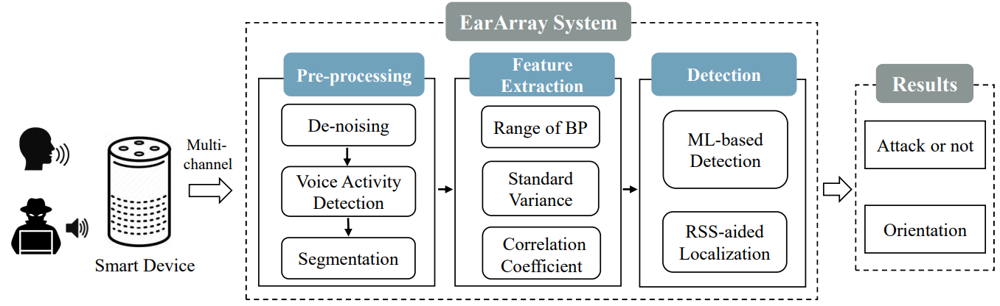

# What is EarArray?

DolphinAttacks (i.e., inaudible voice commands) modulate audible voices over ultrasounds to inject malicious commands silently into voice assistants and manipulate controlled systems (e.g., doors or smart speakers). Eliminating DolphinAttacks is challenging if ever possible since it requires to modify the microphone hardware. In this paper, we design EarArray, a lightweight method that can not only detect such attacks but also identify the direction of attackers without requiring any extra hardware or hardware modification. Essentially, inaudible voice commands are modulated on ultrasounds that inherently attenuate faster than the one of audible sounds. By inspecting the command sound signals via the built-in multiple microphones on smart devices, EarArray is able to estimate the attenuation rate and thus detect the attacks. We propose a model of the propagation of audible sounds and ultrasounds from the sound source to a voice assistant, e.g., a smart speaker, and illustrate the underlying principle and its feasibility. We implemented EarArray using two specially-designed microphone arrays and our experiments show that EarArray can detect inaudible voice commands with an accuracy of 99% and recognize the direction of the attackers with an accuracy of 97.89%.

## How does EarArray work?


# Acoustic Modeling

The acoustic attenuation difference of audible and inaudible voice.

the energy received by microphones in each channel are significantly different due to the attenuation and diffraction of sound wave when the frequency of incident wave is 25 kHz, but it is uniform in the case of low-frequency source


# System Overview of EarArray

The voice commands are first captured by the built-in microphone array on a device, e.g., the Echo dot and the audio signals are then fed into our EarArray system. Finally, the EarArray system will output the detection result i.e., whether the command is a DolphinAttack signal or from a human user. To achieve the above purpose, we have designed EarArray and it mainly consists of three major components, which are 1) Audio signal preprocessing, 2) Feature extraction and 3) Attack detection & localization.



# Performance

Using the specially designed smart speaker, we conducted experiments to evaluate the effectiveness of EarArray in terms of various factors, including carrier frequencies, attack distances, angles, background noise, and voice commands types. We also use the smartphone prototype to evaluate the performance of EarArray on existing hardware with three microphones. According to these experiments, we demonstrate that EarArray can detect the inaudible voice commands with accuracy of above 99%, meanwhile, the accuracy of localization is up to 97.89%. We summarize the main results as follows:


|         **Function**         | **Accuracy** | **Precision** | **Recall** |
| :--------------------------: | :----------: | :-----: | :-----: |
|   Detect attack    |    99.14%    |  99%  |  97.8%  |
| Attack Localization |    97.89%    |  98.4%  |  96%  |


# Read Our paper

Guoming Zhang, Xiaoyu Ji, Xinfeng Li, Gang Qu, Wenyuan Xu. “EarArray: Defending against DolphinAttack via Acoustic Attenuation”, in 2021 The Network and Distributed System Security Symposium (NDSS 2021) [[pdf](https://www.ndss-symposium.org/ndss-paper/eararray-defending-against-dolphinattack-via-acoustic-attenuation/)]

# Citation

```
@article{zhangeararray,
  title={EarArray: Defending against DolphinAttack via Acoustic Attenuation},
  author={Zhang, Guoming and Ji, Xiaoyu and Li, Xinfeng and Qu, Gang and Xu, Wenyuan}
}
```

# Contact
* Prof. Wenyuan Xu (<wyxu@zju.edu.cn>)
* Prof. Xiaoyu Ji (<xji@zju.edu.cn>)

# Powered by

<table bgcolor="white">
<tr valign="middle">
<td width="50%" align="center" colspan="2">
 <a href="http://usslab.org">Ubiquitous System Security Laboratory (USSLab) 
</td>
<td width="50%" align="center" colspan="2">
  <a href="http://www.zju.edu.cn/english">Zhejiang University 
</td>
</tr>
<tr valign="middle">
<td width="50%" align="center" colspan="2">
  <a href="http://usslab.org"></a>
  <a href="http://usslab.org"></a>
</td>
<td width="50%" align="center" colspan="2">
  <a href="http://www.zju.edu.cn/english/"></a>
  <a href="http://www.zju.edu.cn/english/"></a>
</td>
</tr>
</table>
